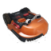
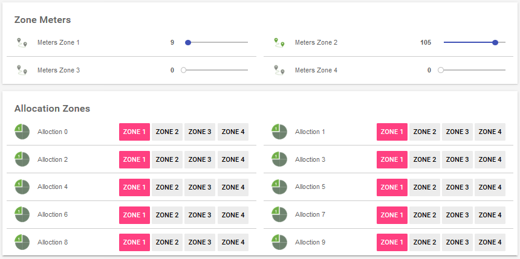
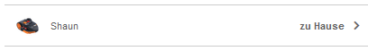

# WorxLandroid Binding
This binding connects openHAB with your WorxLandroid Mower using the API and MQTT.

# Table of contents

 1. [Disclaimer](https://github.com/nibi79/worxlandroid/tree/master#disclaimer)
 2. [Installation and upgrade](https://github.com/nibi79/worxlandroid/tree/master#installation-and-upgrade)
 3. [Supported Things](https://github.com/nibi79/worxlandroid/tree/master#supported-things)
 4. [Discovery](https://github.com/nibi79/worxlandroid/tree/master#discovery)
 5. [Binding Configuration](https://github.com/nibi79/worxlandroid/tree/master#binding-configuration)
 6. [Properties](https://github.com/nibi79/worxlandroid/tree/master#properties)
 7. [Channels](https://github.com/nibi79/worxlandroid/tree/master#channels)
 8. [File based configuration](https://github.com/nibi79/worxlandroid/tree/master#file-based-configuration)
 9. [Iconset](https://github.com/nibi79/worxlandroid/tree/master#iconset)
10. [Support](https://github.com/nibi79/worxlandroid/tree/master#support)

***

## Disclaimer

This binding is currently under development. Your help and testing would be greatly appreciated but there is no stability or functionality warranty.

## Installation and upgrade

For the first installation of the binding you need to copy the [latest release](https://github.com/nibi79/worxlandroid/releases)  into the /addons folder of your openHAB installation. In case you want to upgrade the binding to a newer version, please check the release notes first.

## Supported Things

Currently following Things are supported:

- **WorxLandroid Bridge** Thing representing the handler for Worx API
- One or many Things for supported **WorxLandroid Mower**

## Discovery

Bridge Configuration can be achieved via PaperUI - Configuration - Things - Add Thing “+” Button - WorxLandroid Binding - Add manually - **Bridge Worx Landroid API**. Here you can provide your credentials for your WorxLandroid account. Once the bridge has been added **Worx Landroid Mower**s will be discovered automatically and appear in your PaperUI inbox. You just need to add them as new things.

For textual configuration go to [File based configuration](https://github.com/nibi79/worxlandroid/tree/master#file-based-configuration)

## Binding Configuration

Following options can be set for the **Bridge Worx Landroid API**:

| Property  | Description |
|-----------|-----------|
| webapiUsername | Username to access the WorxLandroid API. |
| webapiPassword | Password to access the WorxLandroid API. |


Following options can be set for the **WorxLandroid Mower**:

| Property  | Description |
|-----------|-----------|
| refreshStatusInterval | Interval for refreshing mower status (ONLINE/OFFLINE) and channel 'common#online' in seconds (min="30")|
| pollingInterval | Interval for polling in seconds (min="30" max="599", after 10 minutes / 600 seconds of inactivity, the connection is closed). |

## Properties

The binding retrieves properties from the API. To view the properties open the thing in PaperUI and click on 'SHOW PROPERTIES':

Bridge:
<br>


Mower:
<br>


## Channels

Currently following **Channels** are supported on the **Worx Landroid Mower**:

##### common

| Channel   | Type | ChannelName | Values |
|------------|-----------|-----------|-----------|
| online      | `Switch` | common#online | |
| lastUpdateOnlineStatus | `DateTime` | common#lastUpdateOnlineStatus | |
| poll | `Switch` | common#poll | |
| action | `String` | common#action | START, STOP, HOME |
| lock | `Switch` | common#lock | |

##### cfgCommon

| Channel   | Type | ChannelName |
|------------|-----------|-----------|
| id      | `Switch` | cfgCommon#id |
| serialNumber | `String` | cfgCommon#serialNumber |
| language | `String` | cfgCommon#language |
| lastUpdate | `DateTime` | cfgCommon#lastUpdate |
| command | `Number` | cfgCommon#command |
| rainDelay | `Number` | cfgCommon#rainDelay |

##### datCommon

| Channel   | Type | ChannelName |
|------------|-----------|-----------|
| macAdress | `String` | datCommon#macAdress |
| firmware | `Number` | datCommon#firmware |
| wifiQuality | `Number` | datCommon#wifiQuality |
| statusCode | `Number` | datCommon#statusCode |
| statusDescription | `String` | datCommon#statusDescription |
| errorCode | `Number` | datCommon#errorCode |
| errorDescription | `String` | datCommon#errorDescription |
| lastZone | `Number` | datCommon#lastZone |

##### datBattery

| Channel   | Type | ChannelName |
|------------|-----------|-----------|
| batteryTemperature | `Number` | datBattery#batteryTemperature |
| batteryVoltage | `Number` | datBattery#batteryVoltage |
| batteryLevel | `Number` | datBattery#batteryLevel |
| batteryChargeCycle | `Number` | datBattery#batteryChargeCycle |
| batteryCharging | `Switch` | datBattery#batteryCharging |

##### datDmp

| Channel   | Type | ChannelName |
|------------|-----------|-----------|
| pitch | `Number` | datDmp#pitch |
| roll | `Number` | datDmp#roll |
| yaw | `Number` | datDmp#yaw |

##### datSt

| Channel   | Type | ChannelName |
|------------|-----------|-----------|
| totalBladeTime | `Number` | datSt#totalBladeTime |
| totalDistance | `Number` | datSt#totalDistance |
| totalTime | `Number` | datSt#totalTime |

##### cfgSc

| Channel   | Type | ChannelName |
|------------|-----------|-----------|
| scheduleTimeExtension | `Number` | cfgSc#scheduleTimeExtension |

##### cfgScSunday

| Channel   | Type | ChannelName |
|------------|-----------|-----------|
| enable | `Switch` | cfgScSunday#enable |
| scheduleStartHour | `Number` | cfgScSunday#scheduleStartHour |
| scheduleStartMinutes | `Number` | cfgScSunday#scheduleStartMinutes |
| scheduleDuration | `Number` | cfgScSunday#scheduleDuration |
| scheduleEdgecut | `Number` | cfgScSunday#scheduleEdgecut |

##### cfgScMonday

| Channel   | Type | ChannelName |
|------------|-----------|-----------|
| enable | `Switch` | cfgScMonday#enable |
| scheduleStartHour | `Number` | cfgScMonday#scheduleStartHour |
| scheduleStartMinutes | `Number` | cfgScMonday#scheduleStartMinutes |
| scheduleDuration | `Number` | cfgScMonday#scheduleDuration |
| scheduleEdgecut | `Number` | cfgScMonday#scheduleEdgecut |

##### cfgScTuesday

| Channel   | Type | ChannelName |
|------------|-----------|-----------|
| enable | `Switch` | cfgScTuesday#enable |
| scheduleStartHour | `Number` | cfgScTuesday#scheduleStartHour |
| scheduleStartMinutes | `Number` | cfgScTuesday#scheduleStartMinutes |
| scheduleDuration | `Number` | cfgScTuesday#scheduleDuration |
| scheduleEdgecut | `Number` | cfgScTuesday#scheduleEdgecut |

##### cfgScWednesday

| Channel   | Type | ChannelName |
|------------|-----------|-----------|
| enable | `Switch` | cfgScWednesday#enable |
| scheduleStartHour | `Number` | cfgScWednesday#scheduleStartHour |
| scheduleStartMinutes | `Number` | cfgScWednesday#scheduleStartMinutes |
| scheduleDuration | `Number` | cfgScWednesday#scheduleDuration |
| scheduleEdgecut | `Number` | cfgScWednesday#scheduleEdgecut |

##### cfgScThursday

| Channel   | Type | ChannelName |
|------------|-----------|-----------|
| enable | `Switch` | cfgScThursday#enable |
| scheduleStartHour | `Number` | cfgScThursday#scheduleStartHour |
| scheduleStartMinutes | `Number` | cfgScThursday#scheduleStartMinutes |
| scheduleDuration | `Number` | cfgScThursday#scheduleDuration |
| scheduleEdgecut | `Number` | cfgScThursday#scheduleEdgecut |

##### cfgScFriday

| Channel   | Type | ChannelName |
|------------|-----------|-----------|
| enable | `Switch` | cfgScFriday#enable |
| scheduleStartHour | `Number` | cfgScFriday#scheduleStartHour |
| scheduleStartMinutes | `Number` | cfgScFriday#scheduleStartMinutes |
| scheduleDuration | `Number` | cfgScFriday#scheduleDuration |
| scheduleEdgecut | `Number` | cfgScFriday#scheduleEdgecut |


##### cfgScSaturday

| Channel   | Type | ChannelName |
|------------|-----------|-----------|
| enable | `Switch` | cfgScSaturday#enable |
| scheduleStartHour | `Number` | cfgScSaturday#scheduleStartHour |
| scheduleStartMinutes | `Number` | cfgScSaturday#scheduleStartMinutes |
| scheduleDuration | `Number` | cfgScSaturday#scheduleDuration |
| scheduleEdgecut | `Number` | cfgScSaturday#scheduleEdgecut |


##### cfgMultiZones
If Multi Zones are supported, you are able to define 4 separate Zones and split working times by 10 to those.

To ease Zone Configuration, you are able to set distance in meters where a specific Zone starts. Bearing in mind that you roughly shall know how many meters of cable have been used (without buffer).

| Channel   | Type | ChannelName |
|------------|-----------|-----------|
| zone1Meter | `Number` | cfgMultiZones#zone1Meter |
| zone2Meter | `Number` | cfgMultiZones#zone2Meter |
| zone3Meter | `Number` | cfgMultiZones#zone3Meter |
| zone4Meter | `Number` | cfgMultiZones#zone4Meter |

As second step you are able to set time in percent and split in parts of 10 between zones,

| Channel   | Type | ChannelName |
|------------|-----------|-----------|
| allocation0 | `Number` | cfgMultiZones#allocation0 |
| allocation1 | `Number` | cfgMultiZones#allocation1 |
| allocation2 | `Number` | cfgMultiZones#allocation2 |
| allocation3 | `Number` | cfgMultiZones#allocation3 |
| allocation4 | `Number` | cfgMultiZones#allocation4 |
| allocation5 | `Number` | cfgMultiZones#allocation5 |
| allocation6 | `Number` | cfgMultiZones#allocation6 |
| allocation7 | `Number` | cfgMultiZones#allocation7 |
| allocation8 | `Number` | cfgMultiZones#allocation8 |
| allocation9 | `Number` | cfgMultiZones#allocation9 |

## File based configuration


<br><br>

<br><br>


### .things
```
Bridge worxlandroid:worxlandroidBridge:MyWorxBridge "MyWorx Bridge" [ webapiUsername="my username", webapiPassword="my password" ] {
    Thing mower MySerialNumber "MyLandroid Shaun" [ refreshStatusInterval=60, pollingInterval=300 ]
}
```
'MySerialNumber' is the serial number of the mower.

### .items
```
String Shaun							"Shaun [%s]"

String          LandroidAction                          "Action []"                         <movecontrol>           {channel="worxlandroid:mower:MyWorxBridge:MySerialNumber:common#action"}
String          LandroidLastUpdate                      "Last Update Data [%s]"             <calendar>              {channel="worxlandroid:mower:MyWorxBridge:MySerialNumber:cfgCommon#lastUpdate"}
Switch          LandroidPoll                            "Poll []"                           <refresh>              {channel="worxlandroid:mower:MyWorxBridge:MySerialNumber:common#poll"}
Switch          LandroidLock                            "Lock []"                           <lock>                  {channel="worxlandroid:mower:MyWorxBridge:MySerialNumber:common#lock"}

//
String          LandroidSerialNumber                    "Serial Number [%s]"                <text>                  {channel="worxlandroid:mower:MyWorxBridge:MySerialNumber:cfgCommon#serialNumber"}
Number          LandroidFirmware                        "Firmware [v%s]"                    <text>                  {channel="worxlandroid:mower:MyWorxBridge:MySerialNumber:datCommon#firmware"}
Switch          LandroidOnline                          "Online [%s]"                       <network>               {channel="worxlandroid:mower:MyWorxBridge:MySerialNumber:common#online"}
String          LandroidLastUpdateOnlineStatus          "Last Update Online Status [%s]"    <calendar>              {channel="worxlandroid:mower:MyWorxBridge:MySerialNumber:common#lastUpdateOnlineStatus"}

// Status
Number          LandroidWifiQuality                     "Wifi Quality [%d]"                 <network>               {channel="worxlandroid:mower:MyWorxBridge:MySerialNumber:datCommon#wifiQuality"}
Switch          LandroidBatteryCharging                 "Battery charging [%s]"             <lowbattery>            {channel="worxlandroid:mower:MyWorxBridge:MySerialNumber:datBattery#batteryCharging"}
Number          LandroidStatusCode                      "Status Code [%d]"                  <lawnmower>             {channel="worxlandroid:mower:MyWorxBridge:MySerialNumber:datCommon#statusCode"}
String          LandroidStatusDescription               "Status [%s]"                       <lawnmower>             {channel="worxlandroid:mower:MyWorxBridge:MySerialNumber:datCommon#statusDescription"}
Number          LandroidErrorCode                       "Error Code [%d]"                   <error>                 {channel="worxlandroid:mower:MyWorxBridge:MySerialNumber:datCommon#errorCode"}
String          LandroidErrorDescription                "Error: [%s]"                       <error>                 {channel="worxlandroid:mower:MyWorxBridge:MySerialNumber:datCommon#errorDescription"}
Number          LandroidLastZone                        "Current Zone []"                   <zone>                                      {channel="worxlandroid:mower:MyWorxBridge:MySerialNumber:datCommon#lastZone"}

// Battery
Number          LandroidBatteryLevel                    "Battery Level [%d %%]"             <battery>               {channel="worxlandroid:mower:MyWorxBridge:MySerialNumber:datBattery#batteryLevel"}
Number          LandroidBatteryVoltage                  "Battery Voltage [%.2f V]"          <battery>               {channel="worxlandroid:mower:MyWorxBridge:MySerialNumber:datBattery#batteryVoltage"}
Number          LandroidBatteryTemperature              "Battery Temperature [%.1f °C]"     <temperature>           {channel="worxlandroid:mower:MyWorxBridge:MySerialNumber:datBattery#batteryTemperature"}
Number          LandroidBatteryChargeCycle              "Battery ChargeCycle [%d]"          <battery>               {channel="worxlandroid:mower:MyWorxBridge:MySerialNumber:datBattery#batteryChargeCycle"}

// Settings
Number          LandroidRainDelay                       "Rain Delay [%d min]"               <rain>                  {channel="worxlandroid:mower:MyWorxBridge:MySerialNumber:cfgCommon#rainDelay"}
Number          LandroidScheduleTimeExtension           "Schedule Time Extension [%d %%]"   <time>                  {channel="worxlandroid:mower:MyWorxBridge:MySerialNumber:cfgSc#scheduleTimeExtension"}

// Statistics
Number          LandroidTotalTime                       "Total Time [%s min]"               <time>                  {channel="worxlandroid:mower:MyWorxBridge:MySerialNumber:datSt#totalTime"}
Number:Length   LandroidTotalDistance                   "Total Distance [%s m]"             <chart>                 {channel="worxlandroid:mower:MyWorxBridge:MySerialNumber:datSt#totalDistance"}
Number          LandroidTotalBladeTime                  "Total Bladetime [%s min]"          <time>                  {channel="worxlandroid:mower:MyWorxBridge:MySerialNumber:datSt#totalBladeTime"}

// Orientation
Number          LandroidPitch                           "Pitch [%.1f°]"                     <incline>               {channel="worxlandroid:mower:MyWorxBridge:MySerialNumber:datDmp#pitch"}
Number          LandroidRoll                            "Roll [%.1f°]"                      <incline>               {channel="worxlandroid:mower:MyWorxBridge:MySerialNumber:datDmp#roll"}
Number          LandroidYaw                             "Yaw [%.1f°]"                       <incline>               {channel="worxlandroid:mower:MyWorxBridge:MySerialNumber:datDmp#yaw"}

//Schedule
// Monday
Switch          LandroidScheduleMondayEnable            "[MAP(landroid_schedule_enable.map):%s]" <time>             {channel="worxlandroid:mower:MyWorxBridge:MySerialNumber:cfgScMonday#enable"}
Number          LandroidScheduleMondayStartHour         "Start Hour [%d]"                   <time>                  {channel="worxlandroid:mower:MyWorxBridge:MySerialNumber:cfgScMonday#scheduleStartHour"}
Number          LandroidScheduleMondayStartMinutes      "Start Minutes [%d]"                <time>                  {channel="worxlandroid:mower:MyWorxBridge:MySerialNumber:cfgScMonday#scheduleStartMinutes"}
Number          LandroidScheduleMondayDuration          "Duration [%d]"                     <time>                  {channel="worxlandroid:mower:MyWorxBridge:MySerialNumber:cfgScMonday#scheduleDuration"}
Switch          LandroidScheduleMondayEdgecut           "Edgecut"                           <lawnmower>             {channel="worxlandroid:mower:MyWorxBridge:MySerialNumber:cfgScMonday#scheduleEdgecut"}

// Tuesday
Switch          LandroidScheduleTuesdayEnable           "[MAP(landroid_schedule_enable.map):%s]" <time>             {channel="worxlandroid:mower:MyWorxBridge:MySerialNumber:cfgScTuesday#enable"}
Number          LandroidScheduleTuesdayStartHour        "Start Hour [%d]"                   <time>                  {channel="worxlandroid:mower:MyWorxBridge:MySerialNumber:cfgScTuesday#scheduleStartHour"}
Number          LandroidScheduleTuesdayStartMinutes     "Start Minutes [%d]"                <time>                  {channel="worxlandroid:mower:MyWorxBridge:MySerialNumber:cfgScTuesday#scheduleStartMinutes"}
Number          LandroidScheduleTuesdayDuration         "Duration [%d]"                     <time>                  {channel="worxlandroid:mower:MyWorxBridge:MySerialNumber:cfgScTuesday#scheduleDuration"}
Switch          LandroidScheduleTuesdayEdgecut          "Edgecut"                           <lawnmower>             {channel="worxlandroid:mower:MyWorxBridge:MySerialNumber:cfgScTuesday#scheduleEdgecut"}

// Wednesday
Switch          LandroidScheduleWednesdayEnable         "[MAP(landroid_schedule_enable.map):%s]" <time>             {channel="worxlandroid:mower:MyWorxBridge:MySerialNumber:cfgScWednesday#enable"}
Number          LandroidScheduleWednesdayStartHour      "Start Hour [%d]"                   <time>                  {channel="worxlandroid:mower:MyWorxBridge:MySerialNumber:cfgScWednesday#scheduleStartHour"}
Number          LandroidScheduleWednesdayStartMinutes   "Start Minutes [%d]"                <time>                  {channel="worxlandroid:mower:MyWorxBridge:MySerialNumber:cfgScWednesday#scheduleStartMinutes"}
Number          LandroidScheduleWednesdayDuration       "Duration [%d]"                     <time>                  {channel="worxlandroid:mower:MyWorxBridge:MySerialNumber:cfgScWednesday#scheduleDuration"}
Switch          LandroidScheduleWednesdayEdgecut        "Edgecut"                           <lawnmower>             {channel="worxlandroid:mower:MyWorxBridge:MySerialNumber:cfgScWednesday#scheduleEdgecut"}

// Thursday
Switch          LandroidScheduleThursdayEnable          "[MAP(landroid_schedule_enable.map):%s]" <time>             {channel="worxlandroid:mower:MyWorxBridge:MySerialNumber:cfgScThursday#enable"}
Number          LandroidScheduleThursdayStartHour       "Start Hour [%d]"                   <time>                  {channel="worxlandroid:mower:MyWorxBridge:MySerialNumber:cfgScThursday#scheduleStartHour"}
Number          LandroidScheduleThursdayStartMinutes    "Start Minutes [%d]"                <time>                  {channel="worxlandroid:mower:MyWorxBridge:MySerialNumber:cfgScThursday#scheduleStartMinutes"}
Number          LandroidScheduleThursdayDuration        "Duration [%d]"                     <time>                  {channel="worxlandroid:mower:MyWorxBridge:MySerialNumber:cfgScThursday#scheduleDuration"}
Switch          LandroidScheduleThursdayEdgecut         "Edgecut"                           <lawnmower>             {channel="worxlandroid:mower:MyWorxBridge:MySerialNumber:cfgScThursday#scheduleEdgecut"}

// Friday
Switch          LandroidScheduleFridayEnable            "[MAP(landroid_schedule_enable.map):%s]" <time>             {channel="worxlandroid:mower:MyWorxBridge:MySerialNumber:cfgScFriday#enable"}
Number          LandroidScheduleFridayStartHour         "Start Hour [%d]"                   <time>                  {channel="worxlandroid:mower:MyWorxBridge:MySerialNumber:cfgScFriday#scheduleStartHour"}
Number          LandroidScheduleFridayStartMinutes      "Start Minutes [%d]"                <time>                  {channel="worxlandroid:mower:MyWorxBridge:MySerialNumber:cfgScFriday#scheduleStartMinutes"}
Number          LandroidScheduleFridayDuration          "Duration [%d]"                     <time>                  {channel="worxlandroid:mower:MyWorxBridge:MySerialNumber:cfgScFriday#scheduleDuration"}
Switch          LandroidScheduleFridayEdgecut           "Edgecut"                           <lawnmower>             {channel="worxlandroid:mower:MyWorxBridge:MySerialNumber:cfgScFriday#scheduleEdgecut"}

// Saturday
Switch          LandroidScheduleSaturdayEnable          "[MAP(landroid_schedule_enable.map):%s]" <time>             {channel="worxlandroid:mower:MyWorxBridge:MySerialNumber:cfgScSaturday#enable"}
Number          LandroidScheduleSaturdayStartHour       "Start Hour [%d]"                   <time>                  {channel="worxlandroid:mower:MyWorxBridge:MySerialNumber:cfgScSaturday#scheduleStartHour"}
Number          LandroidScheduleSaturdayStartMinutes    "Start Minutes [%d]"                <time>                  {channel="worxlandroid:mower:MyWorxBridge:MySerialNumber:cfgScSaturday#scheduleStartMinutes"}
Number          LandroidScheduleSaturdayDuration        "Duration [%d]"                     <time>                  {channel="worxlandroid:mower:MyWorxBridge:MySerialNumber:cfgScSaturday#scheduleDuration"}
Switch          LandroidScheduleSaturdayEdgecut         "Edgecut"                           <lawnmower>             {channel="worxlandroid:mower:MyWorxBridge:MySerialNumber:cfgScSaturday#scheduleEdgecut"}

// Sunday
Switch          LandroidScheduleSundayEnable            "[MAP(landroid_schedule_enable.map):%s]" <time>             {channel="worxlandroid:mower:MyWorxBridge:MySerialNumber:cfgScSunday#enable"}
Number          LandroidScheduleSundayStartHour         "Start Hour [%d]"                   <time>                  {channel="worxlandroid:mower:MyWorxBridge:MySerialNumber:cfgScSunday#scheduleStartHour"}
Number          LandroidScheduleSundayStartMinutes      "Start Minutes [%d]"                <time>                  {channel="worxlandroid:mower:MyWorxBridge:MySerialNumber:cfgScSunday#scheduleStartMinutes"}
Number          LandroidScheduleSundayDuration          "Duration [%d]"                     <time>                  {channel="worxlandroid:mower:MyWorxBridge:MySerialNumber:cfgScSunday#scheduleDuration"}
Switch          LandroidScheduleSundayEdgecut           "Edgecut"                           <lawnmower>             {channel="worxlandroid:mower:MyWorxBridge:MySerialNumber:cfgScSunday#scheduleEdgecut"}

// Zone Meters
Number          LandroidMeterZone1                      "Meters Zone 1 [%d]"                <distance>              {channel="worxlandroid:mower:MyWorxBridge:MySerialNumber:cfgMultiZones#zone1Meter"}
Number          LandroidMeterZone2                      "Meters Zone 2 [%d]"                <distance>              {channel="worxlandroid:mower:MyWorxBridge:MySerialNumber:cfgMultiZones#zone2Meter"}
Number          LandroidMeterZone3                      "Meters Zone 3 [%d]"                <distance>              {channel="worxlandroid:mower:MyWorxBridge:MySerialNumber:cfgMultiZones#zone3Meter"}
Number          LandroidMeterZone4                      "Meters Zone 4 [%d]"                <distance>              {channel="worxlandroid:mower:MyWorxBridge:MySerialNumber:cfgMultiZones#zone4Meter"}

// Allocation Zones
Number          LandroidAllocation0                     "Alloction 0 []"                    <zones>                 {channel="worxlandroid:mower:MyWorxBridge:MySerialNumber:cfgMultiZones#allocation0"}
Number          LandroidAllocation1                     "Alloction 1 []"                    <zones>                 {channel="worxlandroid:mower:MyWorxBridge:MySerialNumber:cfgMultiZones#allocation1"}
Number          LandroidAllocation2                     "Alloction 2 []"                    <zones>                 {channel="worxlandroid:mower:MyWorxBridge:MySerialNumber:cfgMultiZones#allocation2"}
Number          LandroidAllocation3                     "Alloction 3 []"                    <zones>                 {channel="worxlandroid:mower:MyWorxBridge:MySerialNumber:cfgMultiZones#allocation3"}
Number          LandroidAllocation4                     "Alloction 4 []"                    <zones>                 {channel="worxlandroid:mower:MyWorxBridge:MySerialNumber:cfgMultiZones#allocation4"}
Number          LandroidAllocation5                     "Alloction 5 []"                    <zones>                 {channel="worxlandroid:mower:MyWorxBridge:MySerialNumber:cfgMultiZones#allocation5"}
Number          LandroidAllocation6                     "Alloction 6 []"                    <zones>                 {channel="worxlandroid:mower:MyWorxBridge:MySerialNumber:cfgMultiZones#allocation6"}
Number          LandroidAllocation7                     "Alloction 7 []"                    <zones>                 {channel="worxlandroid:mower:MyWorxBridge:MySerialNumber:cfgMultiZones#allocation7"}
Number          LandroidAllocation8                     "Alloction 8 []"                    <zones>                 {channel="worxlandroid:mower:MyWorxBridge:MySerialNumber:cfgMultiZones#allocation8"}
Number          LandroidAllocation9                     "Alloction 9 []"                    <zones>                 {channel="worxlandroid:mower:MyWorxBridge:MySerialNumber:cfgMultiZones#allocation9"}
```

### .sitemap
```
sitemap landroid label="Landroid"
{
    Group item=Shaun icon="landroid" {
        Frame {
            Switch item=LandroidAction label="Action" mappings=[START="Start"] visibility=[LandroidStatusCode==0, LandroidStatusCode==1]
            Switch item=LandroidAction label="Action" mappings=[STOP="Stop",HOME="Home"] visibility=[LandroidStatusCode==7]
            Switch item=LandroidAction label="Action" mappings=[STOP="Stop",HOME="Home"] visibility=[LandroidStatusCode==33]
            Switch item=LandroidAction label="Action" mappings=[START="Start",HOME="Home"] visibility=[LandroidStatusCode==34]
            Switch item=LandroidPoll label="Refresh" mappings=[ON="Poll"]
            Text item=LandroidLastUpdate
            Switch item=LandroidLock label="Lock" mappings=[ON="LOCK",OFF="UNLOCK"]
        }
        Frame {
            Text item=LandroidSerialNumber
            Text item=LandroidFirmware
            Text item=LandroidOnline //mappings=[OFF="Offline", ON="Online"]
            Text item=LandroidLastUpdateOnlineStatus
        }
        Frame label="Status"{
            Text item=LandroidWifiQuality
            Text  item=LandroidBatteryCharging
            Text item=LandroidStatusCode
            Text item=LandroidStatusDescription
            Text item=LandroidErrorCode
            Text item=LandroidErrorDescription
            Text item=LandroidLastZone
        }
        Frame label="Battery"{
            Text item=LandroidBatteryLevel
            Text item=LandroidBatteryVoltage
            Text item=LandroidBatteryTemperature
            Text item=LandroidBatteryChargeCycle
        }
        Frame label="Settings" {
            Slider item=LandroidScheduleTimeExtension minValue=-100 maxValue=100 step=10
            Text label="Schedule" icon="time"{
                Frame label="Schedule Monday" {
                    Switch item=LandroidScheduleMondayEnable
                    Switch item=LandroidScheduleMondayEdgecut visibility=[LandroidScheduleMondayEnable==ON]
                    Setpoint item=LandroidScheduleMondayStartHour minValue=0 maxValue=23 step=1 visibility=[LandroidScheduleMondayEnable==ON]
                    Setpoint item=LandroidScheduleMondayStartMinutes minValue=0 maxValue=45 step=15 visibility=[LandroidScheduleMondayEnable==ON]
                    Setpoint item=LandroidScheduleMondayDuration minValue=0 maxValue=1425 step=15 visibility=[LandroidScheduleMondayEnable==ON]
                }
                Frame label="Schedule Tuesday" {
                    Switch item=LandroidScheduleTuesdayEnable
                    Switch item=LandroidScheduleTuesdayEdgecut visibility=[LandroidScheduleTuesdayEnable==ON]
                    Setpoint item=LandroidScheduleTuesdayStartHour minValue=0 maxValue=23 step=1 visibility=[LandroidScheduleTuesdayEnable==ON]
                    Setpoint item=LandroidScheduleTuesdayStartMinutes minValue=0 maxValue=45 step=15 visibility=[LandroidScheduleTuesdayEnable==ON]
                    Setpoint item=LandroidScheduleTuesdayDuration minValue=0 maxValue=1425 step=15 visibility=[LandroidScheduleTuesdayEnable==ON]
                }
                Frame label="Schedule Wednesday" {
                    Switch item=LandroidScheduleWednesdayEnable
                    Switch item=LandroidScheduleWednesdayEdgecut visibility=[LandroidScheduleWednesdayEnable==ON]
                    Setpoint item=LandroidScheduleWednesdayStartHour minValue=0 maxValue=23 step=1 visibility=[LandroidScheduleWednesdayEnable==ON]
                    Setpoint item=LandroidScheduleWednesdayStartMinutes minValue=0 maxValue=45 step=15 visibility=[LandroidScheduleWednesdayEnable==ON]
                    Setpoint item=LandroidScheduleWednesdayDuration minValue=0 maxValue=1425 step=15 visibility=[LandroidScheduleWednesdayEnable==ON]
                }
                Frame label="Schedule Thursday" {
                    Switch item=LandroidScheduleThursdayEnable
                    Switch item=LandroidScheduleThursdayEdgecut visibility=[LandroidScheduleThursdayEnable==ON]
                    Setpoint item=LandroidScheduleThursdayStartHour minValue=0 maxValue=23 step=1 visibility=[LandroidScheduleThursdayEnable==ON]
                    Setpoint item=LandroidScheduleThursdayStartMinutes minValue=0 maxValue=45 step=15 visibility=[LandroidScheduleThursdayEnable==ON]
                    Setpoint item=LandroidScheduleThursdayDuration minValue=0 maxValue=1425 step=15 visibility=[LandroidScheduleThursdayEnable==ON]
                }
                Frame label="Schedule Friday" {
                    Switch item=LandroidScheduleFridayEnable
                    Switch item=LandroidScheduleFridayEdgecut visibility=[LandroidScheduleFridayEnable==ON]
                    Setpoint item=LandroidScheduleFridayStartHour minValue=0 maxValue=23 step=1 visibility=[LandroidScheduleFridayEnable==ON]
                    Setpoint item=LandroidScheduleFridayStartMinutes minValue=0 maxValue=45 step=15 visibility=[LandroidScheduleFridayEnable==ON]
                    Setpoint item=LandroidScheduleFridayDuration minValue=0 maxValue=1425 step=15 visibility=[LandroidScheduleFridayEnable==ON]
                }
                Frame label="Schedule Saturday" {
                    Switch item=LandroidScheduleSaturdayEnable
                    Switch item=LandroidScheduleSaturdayEdgecut visibility=[LandroidScheduleSaturdayEnable==ON]
                    Setpoint item=LandroidScheduleSaturdayStartHour minValue=0 maxValue=23 step=1 visibility=[LandroidScheduleSaturdayEnable==ON]
                    Setpoint item=LandroidScheduleSaturdayStartMinutes minValue=0 maxValue=45 step=15 visibility=[LandroidScheduleSaturdayEnable==ON]
                    Setpoint item=LandroidScheduleSaturdayDuration minValue=0 maxValue=1425 step=15 visibility=[LandroidScheduleSaturdayEnable==ON]
                }
                Frame label="Schedule Sunday" {
                    Switch item=LandroidScheduleSundayEnable
                    Switch item=LandroidScheduleSundayEdgecut visibility=[LandroidScheduleSundayEnable==ON]
                    Setpoint item=LandroidScheduleSundayStartHour minValue=0 maxValue=23 step=1 visibility=[LandroidScheduleSundayEnable==ON]
                    Setpoint item=LandroidScheduleSundayStartMinutes minValue=0 maxValue=45 step=15 visibility=[LandroidScheduleSundayEnable==ON]
                    Setpoint item=LandroidScheduleSundayDuration minValue=0 maxValue=1425 step=15 visibility=[LandroidScheduleSundayEnable==ON]
                }
            }
            Text label="MultiZone" icon="pie"{
              Frame label="Zone Meters" {
                    Slider item=LandroidMeterZone1 minValue=0 maxValue=90
                    Slider item=LandroidMeterZone2 minValue=0 maxValue=90
                    Slider item=LandroidMeterZone3 minValue=0 maxValue=90
                    Slider item=LandroidMeterZone4 minValue=0 maxValue=90
                }
                Frame label="Allocation Zones" {
                    Switch item=LandroidAllocation0 mappings=[0="Zone 1", 1="Zone 2", 2="Zone 3", 3="Zone 4"]
                    Switch item=LandroidAllocation1 mappings=[0="Zone 1", 1="Zone 2", 2="Zone 3", 3="Zone 4"]
                    Switch item=LandroidAllocation2 mappings=[0="Zone 1", 1="Zone 2", 2="Zone 3", 3="Zone 4"]
                    Switch item=LandroidAllocation3 mappings=[0="Zone 1", 1="Zone 2", 2="Zone 3", 3="Zone 4"]
                    Switch item=LandroidAllocation4 mappings=[0="Zone 1", 1="Zone 2", 2="Zone 3", 3="Zone 4"]
                    Switch item=LandroidAllocation5 mappings=[0="Zone 1", 1="Zone 2", 2="Zone 3", 3="Zone 4"]
                    Switch item=LandroidAllocation6 mappings=[0="Zone 1", 1="Zone 2", 2="Zone 3", 3="Zone 4"]
                    Switch item=LandroidAllocation7 mappings=[0="Zone 1", 1="Zone 2", 2="Zone 3", 3="Zone 4"]
                    Switch item=LandroidAllocation8 mappings=[0="Zone 1", 1="Zone 2", 2="Zone 3", 3="Zone 4"]
                    Switch item=LandroidAllocation9 mappings=[0="Zone 1", 1="Zone 2", 2="Zone 3", 3="Zone 4"]
               }
            }
            Slider item=LandroidRainDelay minValue=0 maxValue=750 step=30
        }
        Frame label="Statistic" {
            Text item=LandroidTotalTime
            Text item=LandroidTotalDistance label="Total Distance [%.2f km]"
            Text item=LandroidTotalBladeTime
        }
        Frame label="Orientation"{
            Text item=LandroidPitch
            Text item=LandroidRoll
            Text item=LandroidYaw
        }
   }
}
```

### .rules

Update Landroid Status to reflect in main menu


<br>

```
rule MowerStatus
when
  Item LandroidErrorCode changed or
  Item LandroidStatusCode changed
then
  if (LandroidErrorCode.state != 0) {
    Shaun.postUpdate(transform("MAP", "landroid_error_de.map", LandroidErrorCode.state.toString))
  } else {
    Shaun.postUpdate(transform("MAP", "landroid_status_de.map", LandroidStatusCode.state.toString))
  }
end
```

Place the following *.map to your ..\conf\transform

1. [landroid_error_de.map](/openhab-conf/transform/landroid_error_de.map)
2. [landroid_status_de.map](/openhab-conf/transform/landroid_status_de.map)

## Iconset

Several Icons have been created in order to suit requirements for robo-mower. Please feel free to download from this repository and place/extract them into ..\conf\icons\classic

1. [Distance](/openhab-conf/icons/distance.zip)
2. [Zones](/openhab-conf/icons/zones.zip)
3. [Refresh](/openhab-conf/icons/refresh.png)
4. [Landroid](/openhab-conf/icons/landroid.png)


## Support

If you encounter critical issues with this binding, please consider to:

- create an [issue](https://github.com/nibi79/worxlandroid/issues) on GitHub
- search [community forum](https://community.openhab.org/) for answers already given
- or make a new post there, if nothing was found

In any case please provide some information about your problem:

- openHAB and binding version
- error description and steps to retrace if applicable
- any related `[WARN]`/`[ERROR]` from openhab.log (`log:set DEBUG org.openhab.binding.worxlandroid`)
- whether it's the binding, bridge, device or channel related issue

For the sake of documentation please use English language.
