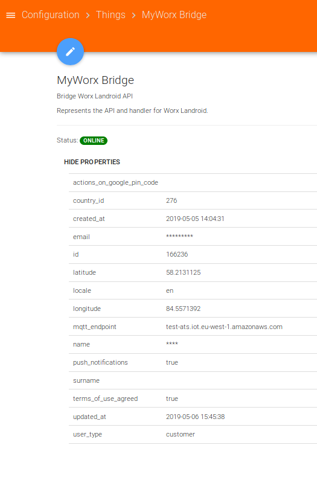
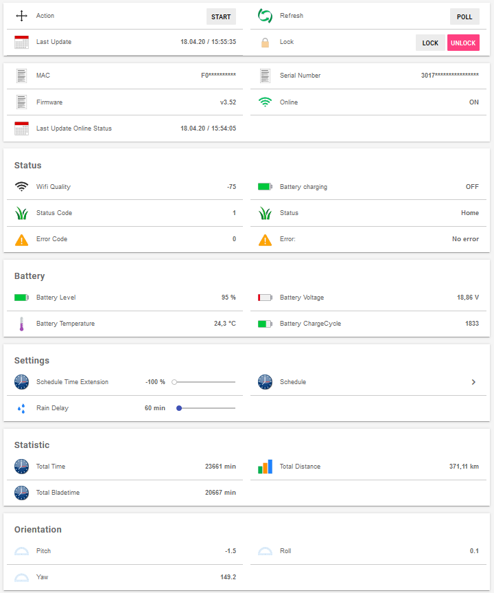

# WorxLandroid Binding

This binding connects openHAB with your WorxLandroid Mower using the API and MQTT.

# Table of contents

1. [Disclaimer](https://github.com/nibi79/worxlandroid/tree/master#disclaimer)
2. [Installation and upgrade](https://github.com/nibi79/worxlandroid/tree/master#installation-and-upgrade)
3. [Supported Things](https://github.com/nibi79/worxlandroid/tree/master#supported-things)
4. [Discovery](https://github.com/nibi79/worxlandroid/tree/master#discovery)
5. [Properties](https://github.com/nibi79/worxlandroid/tree/master#properties)
6. [Configuration](https://github.com/nibi79/worxlandroid/tree/master#configuration)
7. [Channels](https://github.com/nibi79/worxlandroid/tree/master#channels)
8. [File based configuration](https://github.com/nibi79/worxlandroid/tree/master#file-based-configuration)
9. [Support](https://github.com/nibi79/worxlandroid/tree/master#support)

***

## Disclaimer

This binding is currently under development. Your help and testing would be greatly appreciated but there is no stability or functionality warranty.

## Installation and upgrade

For the first installation of the binding you need to copy the [latest release](https://github.com/nibi79/worxlandroid/releases)  into the /addons folder of your openHAB installation. In case you want to upgrade the binding to a newer version, please check the release notes first.

## Supported Things

Currently following Things are supported:

- **WorxLandroid Bridge** Thing representing the handler for Worx API
- One or many Things for supported **WorxLandroid Mower**

## Discovery

Bridge Configuration can be achieved via PaperUI - Configuration - Things - Add Thing “+” Button - WorxLandroid Binding - Add manually - **Bridge Worx Landroid API**. Here you can provide your credentials for your WorxLandroid account. Once the bridge has been added **Worx Landroid Mower**s will be discovered automatically and appear in your PaperUI inbox. You just need to add them as new things.

For textual configuration go to [File based configuration](https://github.com/nibi79/worxlandroid/tree/master#file-based-configuration)

## Binding Configuration

Following options can be set for the **Bridge Worx Landroid API**:

| Property  | Description |
|-----------|-----------|
| webapiUsername | Username to access the WorxLandroid API. |
| webapiPassword | Password to access the WorxLandroid API. |


Following options can be set for the **WorxLandroid Mower**:

| Property  | Description |
|-----------|-----------|
| refreshStatusInterval | Interval for refreshing mower status (ONLINE/OFFLINE) and channel 'common#online' in seconds (min="30")|
| pollingInterval | Interval for polling in seconds (min="30" max="599", after 10 minutes / 600 seconds of inactivity, the connection is closed). |

## Properties

The binding retrieves properties from the API. To view the properties open the thing in PaperUI and click on 'SHOW PROPERTIES':

Bridge:
<br>


Mower:
<br>


## Channels

Currently following **Channels** are supported on the **Worx Landroid Mower**:

##### common

| Channel   | Type | ChannelName | Values |
|------------|-----------|-----------|-----------|
| online      | `Switch` | common#online | |
| lastUpdateOnlineStatus | `DateTime` | common#lastUpdateOnlineStatus | |
| action | `String` | common#action | START, STOP, HOME |

##### cfgCommon

| Channel   | Type | ChannelName |
|------------|-----------|-----------|
| id      | `Switch` | cfgCommon#id |
| serialNumber | `String` | cfgCommon#serialNumber |
| language | `String` | cfgCommon#language |
| lastUpdate | `DateTime` | cfgCommon#lastUpdate |
| command | `Number` | cfgCommon#command |
| rainDelay | `Number` | cfgCommon#rainDelay |

##### datCommon

| Channel   | Type | ChannelName |
|------------|-----------|-----------|
| macAdress | `String` | datCommon#macAdress |
| firmware | `Number` | datCommon#firmware |
| wifiQuality | `Number` | datCommon#wifiQuality |
| statusCode | `Number` | datCommon#statusCode |
| statusDescription | `String` | datCommon#statusDescription |
| errorCode | `Number` | datCommon#errorCode |
| errorDescription | `String` | datCommon#errorDescription |

##### datBattery

| Channel   | Type | ChannelName |
|------------|-----------|-----------|
| batteryTemperature | `Number` | datBattery#batteryTemperature |
| batteryVoltage | `Number` | datBattery#batteryVoltage |
| batteryLevel | `Number` | datBattery#batteryLevel |
| batteryChargeCycle | `Number` | datBattery#batteryChargeCycle |
| batteryCharging | `Switch` | datBattery#batteryCharging |

##### datDmp

| Channel   | Type | ChannelName |
|------------|-----------|-----------|
| pitch | `Number` | datDmp#pitch |
| roll | `Number` | datDmp#roll |
| yaw | `Number` | datDmp#yaw |

##### datSt

| Channel   | Type | ChannelName |
|------------|-----------|-----------|
| totalBladeTime | `Number` | datSt#totalBladeTime |
| totalDistance | `Number` | datSt#totalDistance |
| totalTime | `Number` | datSt#totalTime |

##### datSc

| Channel   | Type | ChannelName |
|------------|-----------|-----------|
| scheduleTimeExtension | `Number` | datSc#scheduleTimeExtension |

##### datScSunday

| Channel   | Type | ChannelName |
|------------|-----------|-----------|
| scheduleStartHour | `Number` | datScSunday#scheduleStartHour |
| scheduleStartMinutes | `Number` | datScSunday#scheduleStartMinutes |
| scheduleDuration | `Number` | datScSunday#scheduleDuration |
| scheduleEdgecut | `Number` | datScSunday#scheduleEdgecut |

##### datScMonday

| Channel   | Type | ChannelName |
|------------|-----------|-----------|
| scheduleStartHour | `Number` | datScMonday#scheduleStartHour |
| scheduleStartMinutes | `Number` | datScMonday#scheduleStartMinutes |
| scheduleDuration | `Number` | datScMonday#scheduleDuration |
| scheduleEdgecut | `Number` | datScMonday#scheduleEdgecut |

##### datScTuesady

| Channel   | Type | ChannelName |
|------------|-----------|-----------|
| scheduleStartHour | `Number` | datScTuesady#scheduleStartHour |
| scheduleStartMinutes | `Number` | datScTuesady#scheduleStartMinutes |
| scheduleDuration | `Number` | datScTuesady#scheduleDuration |
| scheduleEdgecut | `Number` | datScTuesady#scheduleEdgecut |

##### datScWednesday

| Channel   | Type | ChannelName |
|------------|-----------|-----------|
| scheduleStartHour | `Number` | datScWednesday#scheduleStartHour |
| scheduleStartMinutes | `Number` | datScWednesday#scheduleStartMinutes |
| scheduleDuration | `Number` | datScWednesday#scheduleDuration |
| scheduleEdgecut | `Number` | datScWednesday#scheduleEdgecut |

##### datScThursday

| Channel   | Type | ChannelName |
|------------|-----------|-----------|
| scheduleStartHour | `Number` | datScThursday#scheduleStartHour |
| scheduleStartMinutes | `Number` | datScThursday#scheduleStartMinutes |
| scheduleDuration | `Number` | datScThursday#scheduleDuration |
| scheduleEdgecut | `Number` | datScThursday#scheduleEdgecut |

##### datScFriday

| Channel   | Type | ChannelName |
|------------|-----------|-----------|
| scheduleStartHour | `Number` | datScFriday#scheduleStartHour |
| scheduleStartMinutes | `Number` | datScFriday#scheduleStartMinutes |
| scheduleDuration | `Number` | datScFriday#scheduleDuration |
| scheduleEdgecut | `Number` | datScFriday#scheduleEdgecut |


##### datScSaturday

| Channel   | Type | ChannelName |
|------------|-----------|-----------|
| scheduleStartHour | `Number` | datScSaturday#scheduleStartHour |
| scheduleStartMinutes | `Number` | datScSaturday#scheduleStartMinutes |
| scheduleDuration | `Number` | datScSaturday#scheduleDuration |
| scheduleEdgecut | `Number` | datScSaturday#scheduleEdgecut |

## File based configuration


<br><br>


### .things
```
Bridge worxlandroid:worxlandroidBridge:MyWorxBridge "MyWorx Bridge" [ webapiUsername="my username", webapiPassword="my password" ] {
    Thing mower MySerialNumber "MyLandroid Shaun" [ refreshStatusInterval=60, pollingInterval=300 ]
}
```
'MySerialNumber' is the serial number of the mower.

### .items
```
String          LandroidAction                          "Action"                            <movecontrol>           {channel="worxlandroid:mower:MyWorxBridge:MySerialNumber:common#action"}
String          LandroidLastUpdate                      "Last Update Data [%s]"             <calendar>              {channel="worxlandroid:mower:MyWorxBridge:MySerialNumber:cfgCommon#lastUpdate"}
//
String          LandroidSerialNumber                    "Serial Number [%s]"                <text>                  {channel="worxlandroid:mower:MyWorxBridge:MySerialNumber:cfgCommon#serialNumber"}
Number          LandroidFirmware                        "Firmware [v%s]"                    <text>                  {channel="worxlandroid:mower:MyWorxBridge:MySerialNumber:datCommon#firmware"}
Switch          LandroidOnline                          "Online [%s]"                       <network>               {channel="worxlandroid:mower:MyWorxBridge:MySerialNumber:common#online"}
String          LandroidLastUpdateOnlineStatus          "Last Update Online Status [%s]"    <calendar>              {channel="worxlandroid:mower:MyWorxBridge:MySerialNumber:common#lastUpdateOnlineStatus"}

// Status
Number          LandroidWifiQuality                     "Wifi Quality [%d]"                 <network>               {channel="worxlandroid:mower:MyWorxBridge:MySerialNumber:datCommon#wifiQuality"}
Switch          LandroidBatteryCharging                 "Battery charging [%s]"             <lowbattery>            {channel="worxlandroid:mower:MyWorxBridge:MySerialNumber:datBattery#batteryCharging"}
Number          LandroidStatusCode                      "Status Code [%d]"                  <lawnmower>             {channel="worxlandroid:mower:MyWorxBridge:MySerialNumber:datCommon#statusCode"}
String          LandroidStatusDescription               "Status [%s]"                       <lawnmower>             {channel="worxlandroid:mower:MyWorxBridge:MySerialNumber:datCommon#statusDescription"}
Number          LandroidErrorCode                       "Error Code [%d]"                   <error>                 {channel="worxlandroid:mower:MyWorxBridge:MySerialNumber:datCommon#errorCode"}
String          LandroidErrorDescription                "Error: [%s]"                       <error>                 {channel="worxlandroid:mower:MyWorxBridge:MySerialNumber:datCommon#errorDescription"}

// Battery
Number          LandroidBatteryLevel                    "Battery Level [%d %%]"             <battery>               {channel="worxlandroid:mower:MyWorxBridge:MySerialNumber:datBattery#batteryLevel"}
Number          LandroidBatteryVoltage                  "Battery Voltage [%.2f V]"          <battery>               {channel="worxlandroid:mower:MyWorxBridge:MySerialNumber:datBattery#batteryVoltage"}
Number          LandroidBatteryTemperature              "Battery Temperature [%.1f °C]"     <temperature>           {channel="worxlandroid:mower:MyWorxBridge:MySerialNumber:datBattery#batteryTemperature"}
Number          LandroidBatteryChargeCycle              "Battery ChargeCycle [%d]"          <battery>               {channel="worxlandroid:mower:MyWorxBridge:MySerialNumber:datBattery#batteryChargeCycle"}

// Settings
Number          LandroidRainDelay                       "Rain Delay [%d min]"               <rain>                  {channel="worxlandroid:mower:MyWorxBridge:MySerialNumber:cfgCommon#rainDelay"}
Number          LandroidScheduleTimeExtension           "Schedule Time Extension [%d %%]"   <time>                  {channel="worxlandroid:mower:MyWorxBridge:MySerialNumber:datSc#scheduleTimeExtension"}

// Statistics
Number          LandroidTotalTime                       "Total Time [%s min]"               <time>                  {channel="worxlandroid:mower:MyWorxBridge:MySerialNumber:datSt#totalTime"}
Number:Length   LandroidTotalDistance                   "Total Distance [%s m]"             <chart>                 {channel="worxlandroid:mower:MyWorxBridge:MySerialNumber:datSt#totalDistance"}
Number          LandroidTotalBladeTime                  "Total Bladetime [%s min]"          <time>                  {channel="worxlandroid:mower:MyWorxBridge:MySerialNumber:datSt#totalBladeTime"}

//Schedule
// Monday
Number          LandroidScheduleMondayStartHour         "Start Hour [%d]"                   <time>                  {channel="worxlandroid:mower:MyWorxBridge:MySerialNumber:datScMonday#scheduleStartHour"}
Number          LandroidScheduleMondayStartMinutes      "Start Minutes [%d]"                <time>                  {channel="worxlandroid:mower:MyWorxBridge:MySerialNumber:datScMonday#scheduleStartMinutes"}
Number          LandroidScheduleMondayDuration          "Duration [%d]"                     <time>                  {channel="worxlandroid:mower:MyWorxBridge:MySerialNumber:datScMonday#scheduleDuration"}
Switch          LandroidScheduleMondayEdgecut           "Edgecut "                          <settings>              {channel="worxlandroid:mower:MyWorxBridge:MySerialNumber:datScMonday#scheduleEdgecut"}

// Tuesday
Number          LandroidScheduleTuesdayStartHour        "Start Hour [%d]"                   <time>                  {channel="worxlandroid:mower:MyWorxBridge:MySerialNumber:datScTuesday#scheduleStartHour"}
Number          LandroidScheduleTuesdayStartMinutes     "Start Minutes [%d]"                <time>                  {channel="worxlandroid:mower:MyWorxBridge:MySerialNumber:datScTuesday#scheduleStartMinutes"}
Number          LandroidScheduleTuesdayDuration         "Duration [%d]"                     <time>                  {channel="worxlandroid:mower:MyWorxBridge:MySerialNumber:datScTuesday#scheduleDuration"}
Switch          LandroidScheduleTuesdayEdgecut          "Edgecut "                          <settings>              {channel="worxlandroid:mower:MyWorxBridge:MySerialNumber:datScTuesday#scheduleEdgecut"}

// Wednesday
Number          LandroidScheduleWednesdayStartHour      "Start Hour [%d]"                   <time>                  {channel="worxlandroid:mower:MyWorxBridge:MySerialNumber:datScWednesday#scheduleStartHour"}
Number          LandroidScheduleWednesdayStartMinutes   "Start Minutes [%d]"                <time>                  {channel="worxlandroid:mower:MyWorxBridge:MySerialNumber:datScWednesday#scheduleStartMinutes"}
Number          LandroidScheduleWednesdayDuration       "Duration [%d]"                     <time>                  {channel="worxlandroid:mower:MyWorxBridge:MySerialNumber:datScWednesday#scheduleDuration"}
Switch          LandroidScheduleWednesdayEdgecut        "Edgecut "                          <settings>              {channel="worxlandroid:mower:MyWorxBridge:MySerialNumber:datScWednesday#scheduleEdgecut"}

// Thursday
Number          LandroidScheduleThursdayStartHour       "Start Hour [%d]"                   <time>                  {channel="worxlandroid:mower:MyWorxBridge:MySerialNumber:datScThursday#scheduleStartHour"}
Number          LandroidScheduleThursdayStartMinutes    "Start Minutes [%d]"                <time>                  {channel="worxlandroid:mower:MyWorxBridge:MySerialNumber:datScThursday#scheduleStartMinutes"}
Number          LandroidScheduleThursdayDuration        "Duration [%d]"                     <time>                  {channel="worxlandroid:mower:MyWorxBridge:MySerialNumber:datScThursday#scheduleDuration"}
Switch          LandroidScheduleThursdayEdgecut         "Edgecut "                          <settings>              {channel="worxlandroid:mower:MyWorxBridge:MySerialNumber:datScThursday#scheduleEdgecut"}

// Friday
Number          LandroidScheduleFridayStartHour         "Start Hour [%d]"                   <time>                  {channel="worxlandroid:mower:MyWorxBridge:MySerialNumber:datScFriday#scheduleStartHour"}
Number          LandroidScheduleFridayStartMinutes      "Start Minutes [%d]"                <time>                  {channel="worxlandroid:mower:MyWorxBridge:MySerialNumber:datScFriday#scheduleStartMinutes"}
Number          LandroidScheduleFridayDuration          "Duration [%d]"                     <time>                  {channel="worxlandroid:mower:MyWorxBridge:MySerialNumber:datScFriday#scheduleDuration"}
Switch          LandroidScheduleFridayEdgecut           "Edgecut "                          <settings>              {channel="worxlandroid:mower:MyWorxBridge:MySerialNumber:datScFriday#scheduleEdgecut"}

// Saturday
Number          LandroidScheduleSaturdayStartHour       "Start Hour [%d]"                   <time>                  {channel="worxlandroid:mower:MyWorxBridge:MySerialNumber:datScSaturday#scheduleStartHour"}
Number          LandroidScheduleSaturdayStartMinutes    "Start Minutes [%d]"                <time>                  {channel="worxlandroid:mower:MyWorxBridge:MySerialNumber:datScSaturday#scheduleStartMinutes"}
Number          LandroidScheduleSaturdayDuration        "Duration [%d]"                     <time>                  {channel="worxlandroid:mower:MyWorxBridge:MySerialNumber:datScSaturday#scheduleDuration"}
Switch          LandroidScheduleSaturdayEdgecut         "Edgecut "                          <settings>              {channel="worxlandroid:mower:MyWorxBridge:MySerialNumber:datScSaturday#scheduleEdgecut"}

// Sunday
Number          LandroidScheduleSundayStartHour         "Start Hour [%d]"                   <time>                  {channel="worxlandroid:mower:MyWorxBridge:MySerialNumber:datScSunday#scheduleStartHour"}
Number          LandroidScheduleSundayStartMinutes      "Start Minutes [%d]"                <time>                  {channel="worxlandroid:mower:MyWorxBridge:MySerialNumber:datScSunday#scheduleStartMinutes"}
Number          LandroidScheduleSundayDuration          "Duration [%d]"                     <time>                  {channel="worxlandroid:mower:MyWorxBridge:MySerialNumber:datScSunday#scheduleDuration"}
Switch          LandroidScheduleSundayEdgecut           "Edgecut "                          <settings>              {channel="worxlandroid:mower:MyWorxBridge:MySerialNumber:datScSunday#scheduleEdgecut"}
```

### .sitemap
```
sitemap landroid label="Landroid"
{
    Frame {
        Switch item=LandroidAction mappings=[START="Start", STOP="Stop", HOME="Go Home"]
         Text item=LandroidLastUpdate
    }
    Frame {
        Text item=LandroidSerialNumber
        Text item=LandroidFirmware
        Text item=LandroidOnline //mappings=[OFF="Offline", ON="Online"]
        Text item=LandroidLastUpdateOnlineStatus
    }
    Frame label="Status"{
        Text item=LandroidWifiQuality
        Text  item=LandroidBatteryCharging
        Text item=LandroidStatusCode
        Text item=LandroidStatusDescription
        Text item=LandroidErrorCode
        Text item=LandroidErrorDescription
    }
    Frame label="Battery"{
        Text item=LandroidBatteryLevel
        Text item=LandroidBatteryVoltage
        Text item=LandroidBatteryTemperature
        Text item=LandroidBatteryChargeCycle
    }
    Frame label="Settings" {
        Setpoint item=LandroidScheduleTimeExtension minValue=-100 maxValue=100 step=10
        Text label="Schedule" icon="time"{
            Frame label="Schedule Monday" {
                Setpoint item=LandroidScheduleMondayStartHour minValue=0 maxValue=23 step=1
                Setpoint item=LandroidScheduleMondayStartMinutes minValue=0 maxValue=45 step=15
                Setpoint item=LandroidScheduleMondayDuration minValue=15 maxValue=1425 step=15
                Switch item=LandroidScheduleMondayEdgecut
            }
            Frame label="Schedule Tuesday" {
                Setpoint item=LandroidScheduleTuesdayStartHour minValue=0 maxValue=23 step=1
                Setpoint item=LandroidScheduleTuesdayStartMinutes minValue=0 maxValue=45 step=15
                Setpoint item=LandroidScheduleTuesdayDuration minValue=15 maxValue=1425 step=15
                Switch item=LandroidScheduleTuesdayEdgecut
            }
            Frame label="Schedule Wednesday" {
                Setpoint item=LandroidScheduleWednesdayStartHour minValue=0 maxValue=23 step=1
                Setpoint item=LandroidScheduleWednesdayStartMinutes minValue=0 maxValue=45 step=15
                Setpoint item=LandroidScheduleWednesdayDuration minValue=15 maxValue=1425 step=15
                Switch item=LandroidScheduleWednesdayEdgecut
            }
            Frame label="Schedule Thursday" {
                Setpoint item=LandroidScheduleThursdayStartHour minValue=0 maxValue=23 step=1
                Setpoint item=LandroidScheduleThursdayStartMinutes minValue=0 maxValue=45 step=15
                Setpoint item=LandroidScheduleThursdayDuration minValue=15 maxValue=1425 step=15
                Switch item=LandroidScheduleThursdayEdgecut
            }
            Frame label="Schedule Friday" {
                Setpoint item=LandroidScheduleFridayStartHour minValue=0 maxValue=23 step=1
                Setpoint item=LandroidScheduleFridayStartMinutes minValue=0 maxValue=45 step=15
                Setpoint item=LandroidScheduleFridayDuration minValue=15 maxValue=1425 step=15
                Switch item=LandroidScheduleFridayEdgecut
            }
            Frame label="Schedule Saturday" {
                Setpoint item=LandroidScheduleSaturdayStartHour minValue=0 maxValue=23 step=1
                Setpoint item=LandroidScheduleSaturdayStartMinutes minValue=0 maxValue=45 step=15
                Setpoint item=LandroidScheduleSaturdayDuration minValue=15 maxValue=1425 step=15
                Switch item=LandroidScheduleSaturdayEdgecut
            }
            Frame label="Schedule Sunday" {
                Setpoint item=LandroidScheduleSundayStartHour minValue=0 maxValue=23 step=1
                Setpoint item=LandroidScheduleSundayStartMinutes minValue=0 maxValue=45 step=15
                Setpoint item=LandroidScheduleSundayDuration minValue=15 maxValue=1425 step=15
                Switch item=LandroidScheduleSundayEdgecut
            }
        }
        Setpoint item=LandroidRainDelay minValue=0 maxValue=750 step=30
    }
    Frame label="Statistic" {
        Text item=LandroidTotalTime
        Text item=LandroidTotalDistance label="Total Distance [%.2f km]"
        Text item=LandroidTotalBladeTime
    }
}
```

### .rules
```
TODO
```

## Support

If you encounter critical issues with this binding, please consider to:

- create an [issue](https://github.com/nibi79/worxlandroid/issues) on GitHub
- search [community forum](https://community.openhab.org/) for answers already given
- or make a new post there, if nothing was found

In any case please provide some information about your problem:

- openHAB and binding version
- error description and steps to retrace if applicable
- any related `[WARN]`/`[ERROR]` from openhab.log (`log:set DEBUG org.openhab.binding.worxlandroid`)
- whether it's the binding, bridge, device or channel related issue

For the sake of documentation please use English language.

